# Tugas Modul 4: Firewall & NAT

**Kelompok:** 18-Dynamic Host  
**Anggota:** Adzkia Anfariza Rizqika, Arini Yanua Sari, Ilan Hawari Prasojo  
**NRP:** 5024241003, 5024241015, 5024241039  

---

## 1. Topologi Jaringan
Berikut adalah topologi yang digunakan pada tugas modul ini.

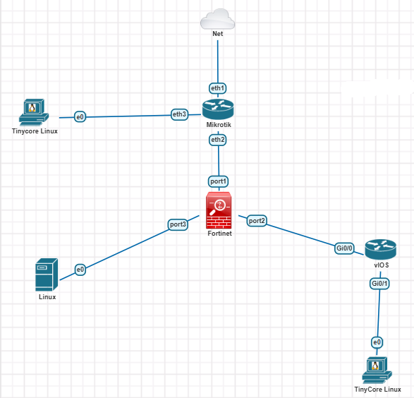


---


## 3. Konfigurasi dan IP Address pada Tiap Perangkat
Terdapat beberapa perangkat yang digunakan dan harus dikonfigurasi dalam tugas modul ini, berikut adalah konfigurasi pada perangkat-perangkat tersebut:

### Fortigate
Hasil konfigurasi untuk fortigate adalah sebagai berikut:
**Command Line / Script:**
```bash
show system interface
```
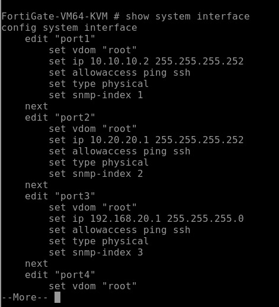
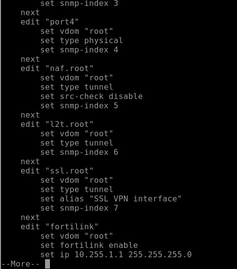
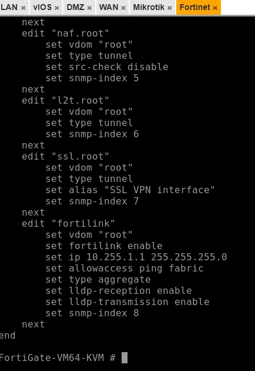

```bash
show router static
```
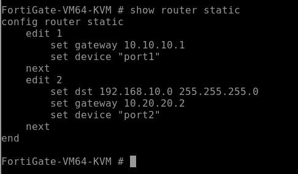

```bash
show firewall policy
```
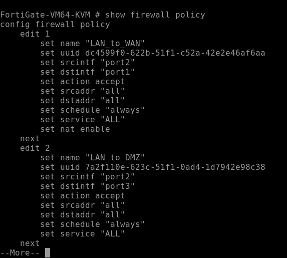
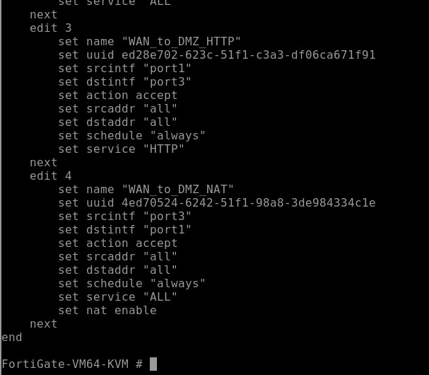


### MikroTik
Hasil konfigurasi untuk MikroTik adalah sebagai berikut:

```bash
ip address print
```
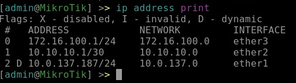

```bash
ip route print
```
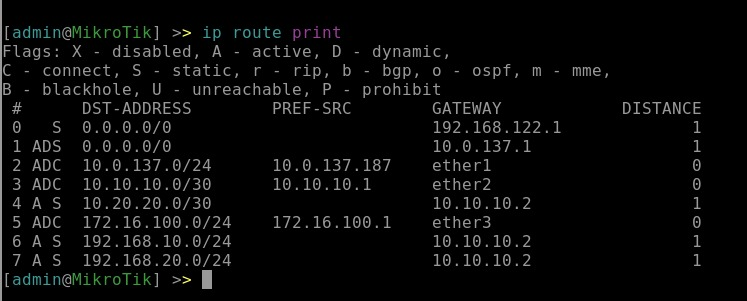

```bash
ip firewall NAT print
```
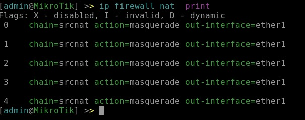

### Cisco
Hasil konfigurasi untuk Cisco adalah sebagai berikut:

```bash
show ip int brief
```
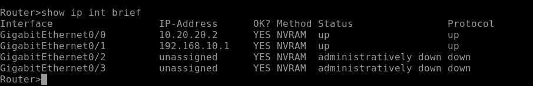

```bash
show ip route
```
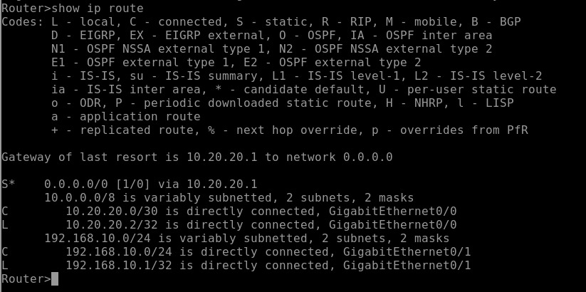

### DMZ
Hasil konfigurasi untuk DMZ adalah sebagai berikut:

```bash
ip addr show
```
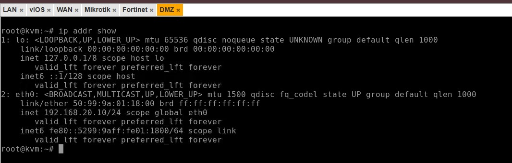

```bash
curl localhost
```
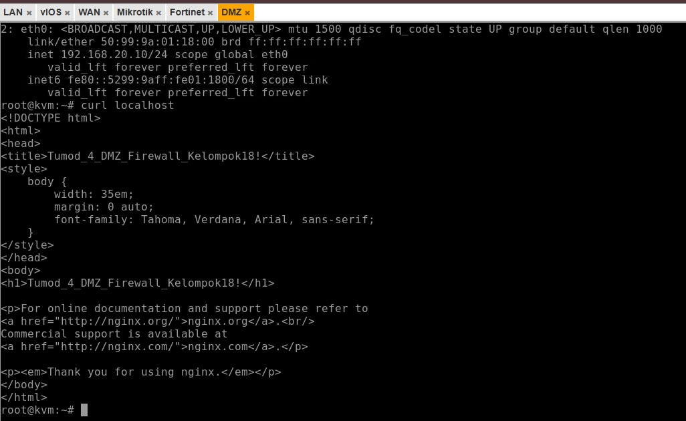

## 4. Hasil Pengujian
Berikut adalah hasil pengujian yang dilakukan pada topologi

### Pengujian client LAN ke gateway Cisco
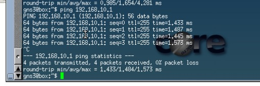

### Pengujian client lan ke fortigate
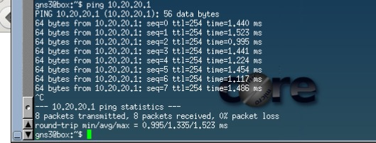

### Pengujian client lan ke DMZ
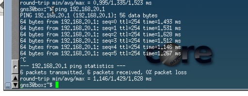

### Pengujian client lan akses ip DMZ
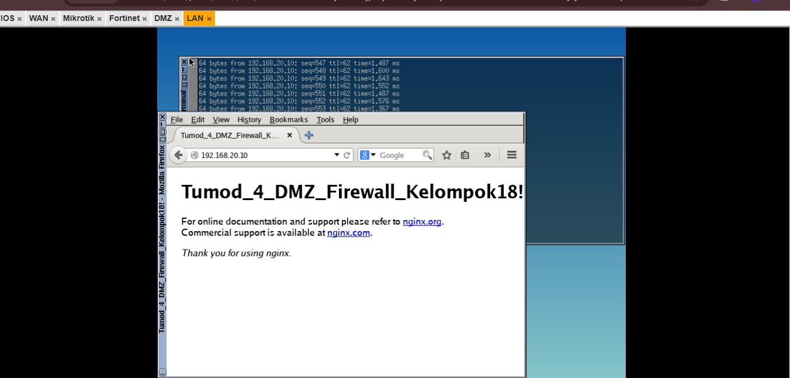
## 5. Analisis
Topologi tugas modul ini mengimplementasikan arsitektur berbasis zona keamanan menggunakan router Mikrotik dan firewall Fortinet. Mikrotik berfungsi sebagai gateway internet utama sekaligus melayani Outside Zone (jaringan publik) pada segmen 172.16.100.0/24. Jaringan kemudian diteruskan ke Fortinet (10.10.10.0/30) yang bertugas mengelola dan mengamankan dua zona lainnya. Pertama, DMZ Zone (192.168.20.0/24) yang terhubung langsung ke Fortinet sebagai area server terisolasi. Kedua, LAN Zone (jaringan privat internal), di mana Fortinet tidak terhubung langsung ke client, melainkan melewati router distribusi vIOS (10.20.20.0/30) yang kemudian membagikan jaringan ke end-device pada segmen 192.168.10.0/24. Berdasarkan analisis konfigurasi, terjadi kegagalan ping dari area WAN ke zona DMZ dan LAN membuktikan bahwa kebijakan keamanan pada firewall Fortinet telah berfungsi sebagaimana mestinya. Secara infrastruktur, routing antar zona sebenarnya sudah terhubung dengan benar. Namun, paket ping (ICMP) dari WAN ke DMZ diblokir karena Firewall Policy secara spesifik hanya mengizinkan protokol HTTP (akses web server) dari arah luar. Sementara itu, akses dari WAN ke LAN ditolak sepenuhnya karena ketiadaan aturan yang mengizinkan lalu lintas masuk dari area publik ke area privat (Default Deny). Hal ini menunjukkan bahwa pemisahan zona jaringan pada topologi ini telah berhasil mengamankan area internal dari akses publik yang tidak sah sesuai standar enterprise.
## 6. Kesimpulan
Berdasarkan seluruh proses konfigurasi dan pengujian, praktikum ini berhasil mengimplementasikan topologi jaringan berbasis zona (Outside, DMZ, dan LAN) dengan routing antar perangkat yang terhubung dengan baik secara layer 3. Terblokirnya akses ping dari area publik (WAN) menuju DMZ dan LAN bukanlah sebuah error konektivitas, melainkan bukti bahwa kebijakan keamanan default deny pada firewall Fortinet telah berfungsi secara optimal. Secara keseluruhan, arsitektur jaringan ini sukses mengamankan area privat dari akses luar yang tidak sah, sekaligus memvalidasi berjalannya filtrasi protokol yang secara spesifik hanya mengizinkan layanan web (HTTP) menuju server DMZ sesuai dengan standar keamanan enterprise.