# Tugas Modul 5: Vlan Trunk OSPF MultiVendor

**Kelompok 18-Dynamic Host**  
Adzkia Anfariza Rizqika-5024241003  
Arini Yanua Sari-5024241015  
Ilan Hawari Prasojo-5024241039

---

## 1. Topologi Jaringan
Berikut adalah topologi jaringan yang digunakan pada tugas modul ini:  

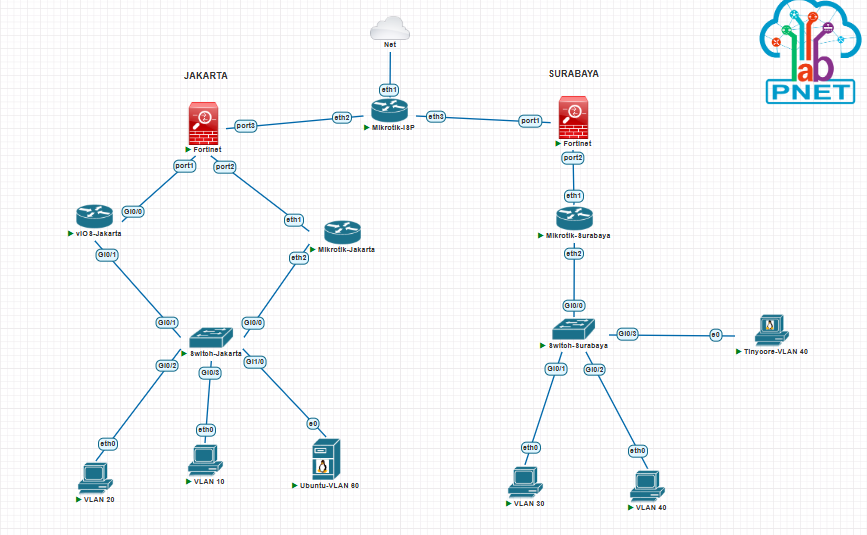

---

## 2. Konfigurasi
Berikut adalah konfigurasi yang dilakukan, yang terbagi menjadi beberapa bagian modul.

### Modul 1: Konfigurasi Cisco Switch Jakarta
Membuat VLAN 10, 20, dan 60, mengatur port setiap VLAN, dan mengatur link sebagai trunk.
```bash
show vlan brief
```
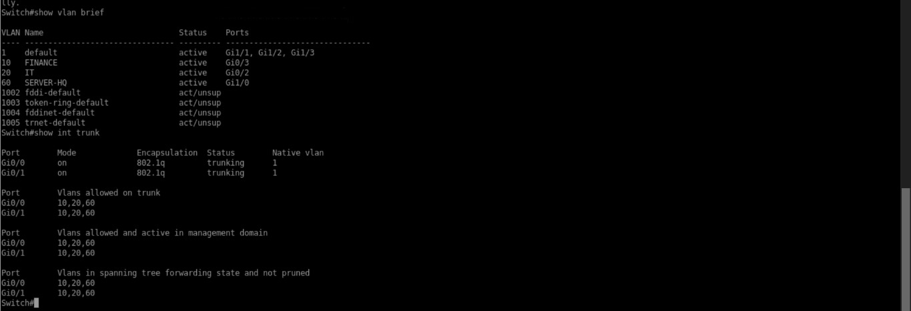

```bash
show interfaces trunk
```

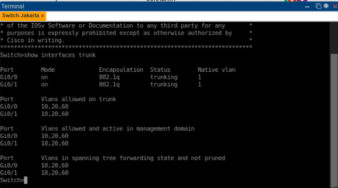


### Modul 2: Konfigurasi Cisco Router Jakarta

Konfigurasikan Cisco Router Jakarta dengan membuat subinterface beserta IP fisiknya untuk VLAN 10, 20, dan 60, menetapkannya sebagai VRRP master pada VLAN 10 dan 60, mengaktifkan DHCP Relay menuju Ubuntu Server, serta mengatur tautan dan *default route* ke arah FortiGate Jakarta.

```bash
show ip interface brief
```
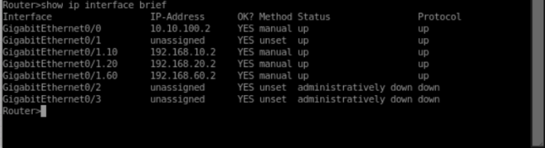

```bash
show vrrp brief
```
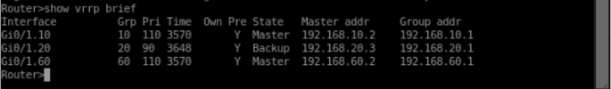

Screenshot konfigurasi subinterface
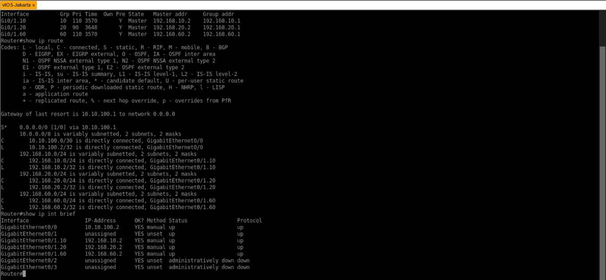

melakukan ping kepada Fortigate Jakarta
```bash
ping 10.10.100.1
```
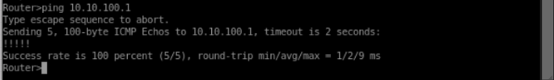


### Modul 3: Konfigurasi MikroTik Router Jakarta

Konfigurasi MikroTik Jakarta dengan membuat VLAN interface beserta IP fisiknya untuk VLAN 10, 20, dan 60, mengatur VRRP di mana MikroTik bertindak sebagai master khusus pada VLAN 20, mengaktifkan DHCP Relay menuju Ubuntu Server, serta menyiapkan tautan dan default route ke arah FortiGate Jakarta.

```bash
/ip address print
```
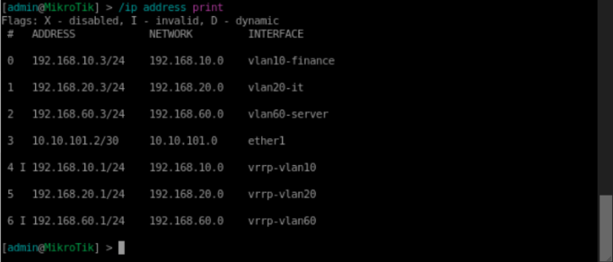

```bash
/interface vrrp print
```
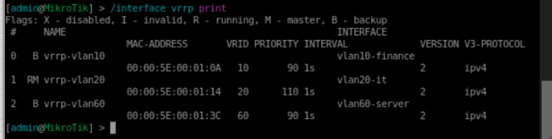

```bash
/ip dhcp-relay print
```
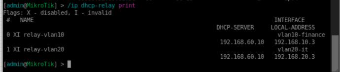

```bash
/ip route print
```
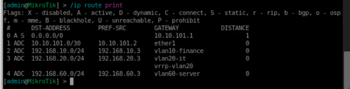

Melakukan ping kepada FortiGate Jakarta
```bash
ping 10.10.101.1
```
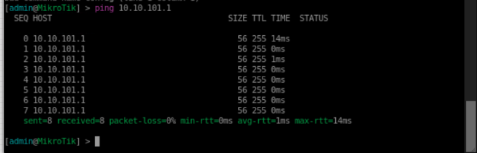


### Modul 4: Konfigurasi Ubuntu Server Jakarta

Menyambungkan Ubuntu Server Jakarta ke jaringan manajemen terlebih dahulu untuk menginstal isc-dhcp-server dan Nginx, lalu memindahkan koneksinya ke VLAN 60 untuk mengonfigurasi IP statis dengan gateway Virtual IP VRRP, mengatur pool DHCP untuk VLAN 10 dan 20, serta menyesuaikan halaman utama web Nginx dengan identitas server.

```bash
ip a
```
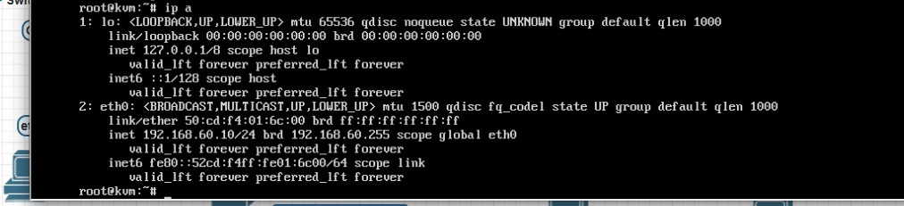
```bash
ip route
```


```bash
sudo cat /etc/dhcp/dhcpd.conf
```
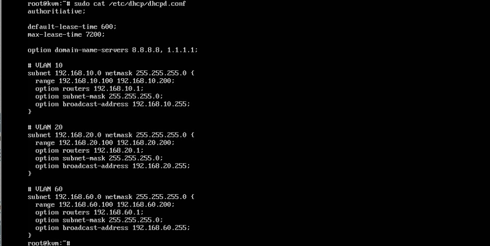

Melakukan ping kepada 8.8.8.8
```bash
ping 8.8.8.8
```
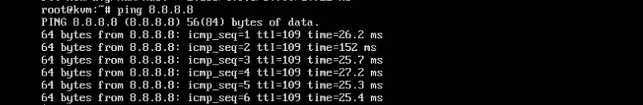


### Modul 5: Konfigurasi FortiGate Jakarta
Mengkonfigurasi FortiGate Jakarta dengan mengatur antarmuka ke arah router internal (Cisco dan MikroTik) serta ISP, menetapkan default dan static route, membuat kebijakan firewall dengan NAT untuk akses internet, serta membangun GRE Tunnel menuju Surabaya yang menjalankan OSPF beserta redistribusi rute statis.

```bash
get system interface physical
```
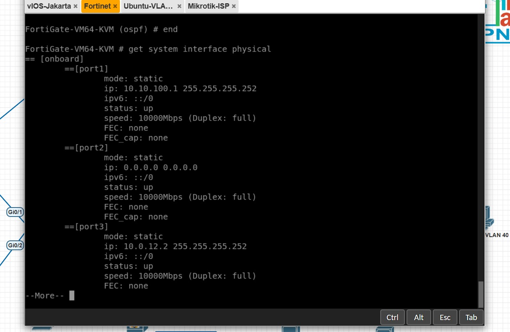

```bash
get router info routing-table all
```
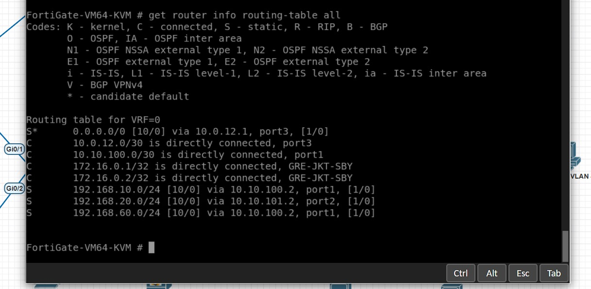

```bash
get firewall policy
```
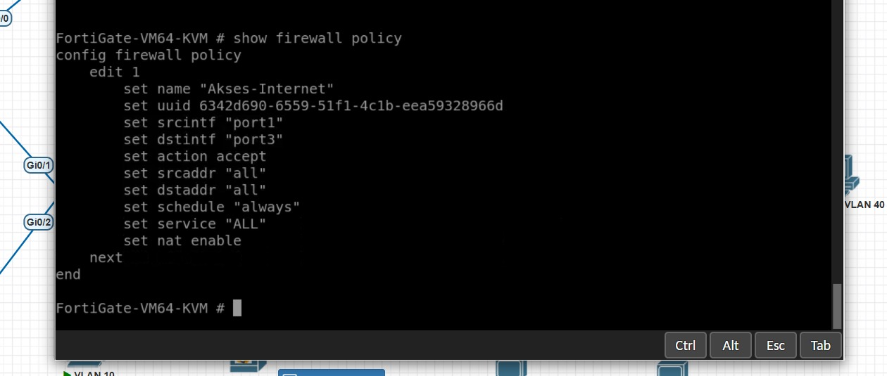

```bash
ping 8.8.8.8
```
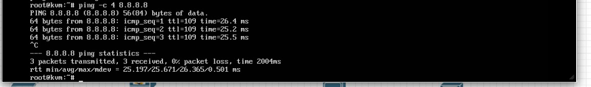

```bash 
ping 172.16.0.1
```
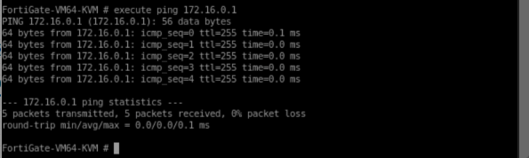

```bash
get router info ospf neighbor
```
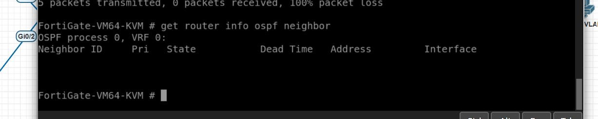

```bash
get router info routing-table ospf
```
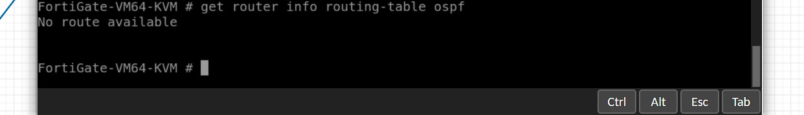


### Modul 6: Konfigurasi Mikrotik ISP
Mengkonfigurasi IP pada antarmuka menuju FortiGate Jakarta dan Surabaya, menyiapkan koneksi ke Cloud NAT PNETLab dengan default route dan NAT masquerade untuk akses internet, serta memastikan kedua FortiGate dapat saling terhubung melalui ISP.

```bash
/ip address print
```
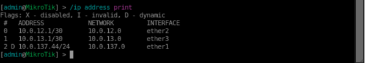

```bash
/ip route print
```
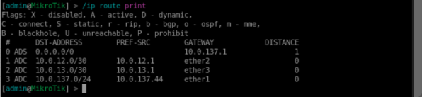

```bash
/ip firewall nat print
```
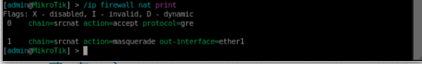

Melakukan ping ke google
```bash
ping 8.8.8.8
```
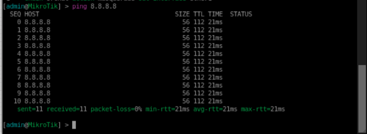

```bash
ping 172.16.0.2
```
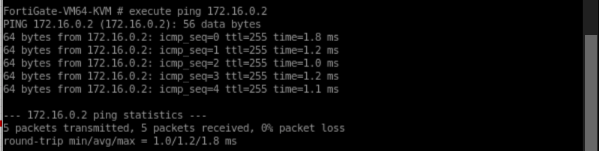


### Modul 7: Konfigurasi Switch dan MikroTik Surabaya
Mengonfigurasi perangkat Surabaya dengan membuat VLAN 30 dan 40 pada switch, mengatur port klien sebagai access dan tautan ke MikroTik sebagai trunk, membuat antarmuka VLAN di MikroTik, memberikan gateway, mengonfigurasi DHCP Server untuk VLAN 30 serta menggunakan IP statis untuk VLAN 40, lalu mengatur tautan dan menambahkan default route menuju FortiGate Surabaya.

```bash
show vlan brief
```
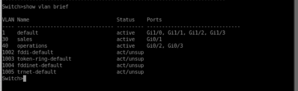

```bash
show interfaces trunk
```
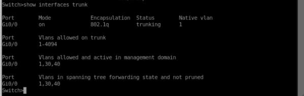

```bash
/ip address print
```
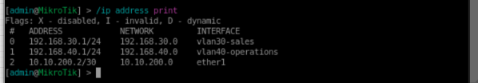

```bash
/ip dhcp-server print
```
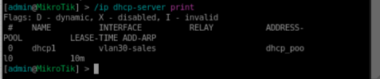

```bash
/ip pool print
```
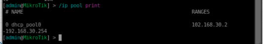

```bash
/ip route print
```
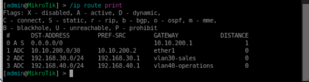

Cek ip client
```bash
ip dhcp
```


Ping client Surabaya ke 8.8.8.8
```bash
ping 8.8.8.8
```
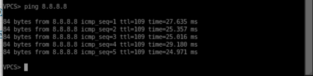


### Modul 8: Konfigurasi FortiGate Surabaya
Berikut adalah ringkasannya dalam satu kalimat:

Mengonfigurasi FortiGate Surabaya dengan mengatur antarmuka menuju MikroTik ISP dan MikroTik Surabaya, menambahkan *default* dan *static route*, membuat kebijakan *firewall* beserta NAT untuk akses internet, serta membangun GRE Tunnel ke arah FortiGate Jakarta yang menjalankan OSPF dengan redistribusi rute statis.

```bash
get system interface physical
```
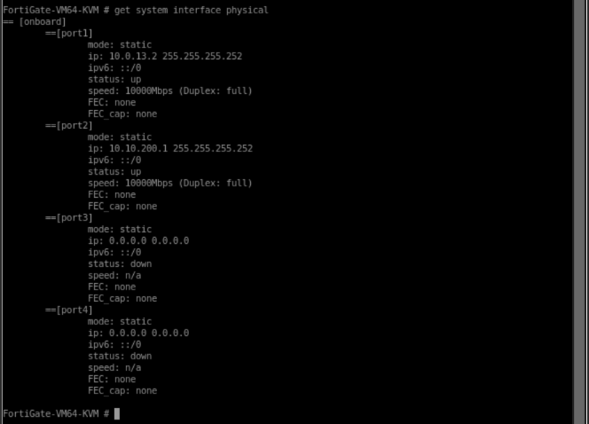

```bash
get router info routing-table all
```
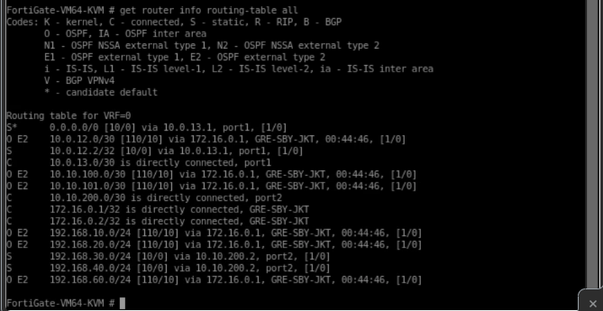

```bash
show firewall policy
```
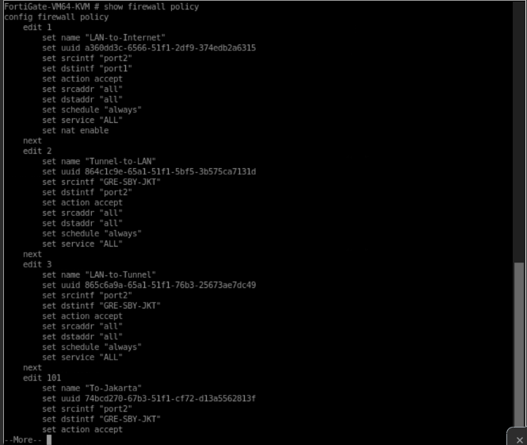
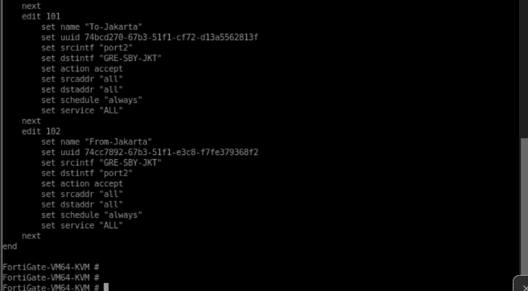

```bash
ping 8.8.8.8
```
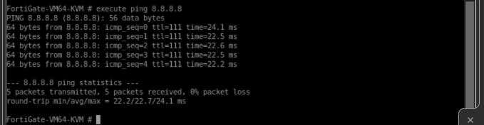

```bash
execute ping 172.16.0.1
```
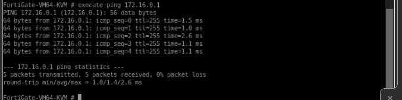

```bash
get router info ospf neighbor
```


```bash
get router info routing-table ospf
```
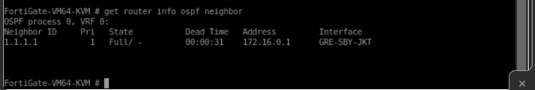

### Modul 9: Konfigurasi GRE Tunnel dan OSPF over GRE
Memastikan IP WAN saling menyambung untuk membuat GRE Tunnel dan memberikan IP tunnel pada kedua FortiGate, kemudian menguji koneksi tersebut sebelum menjalankan OSPF dan mengaktifkan redistribusi rute statis guna memastikan rute antar-situs mencapai tujuannya.

```bash
ping 10.0.12.2
```
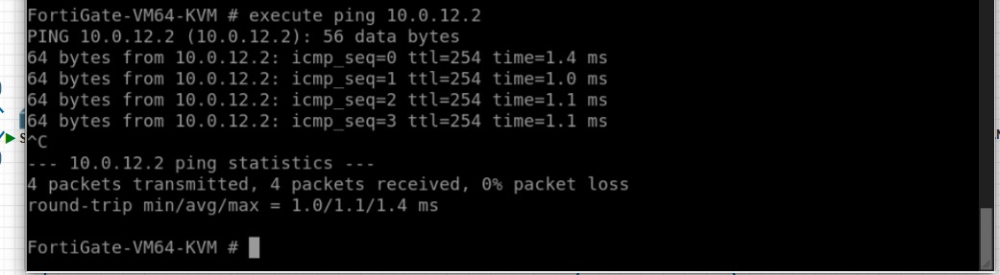

```bash
ping 172.16.0.1
```
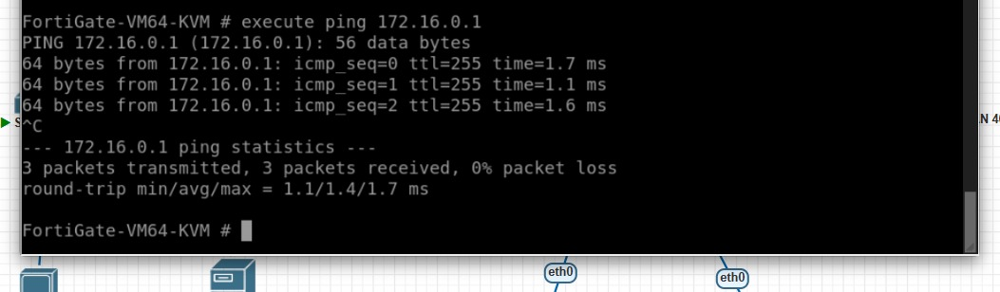

```bash
get router info ospf neighbor
```
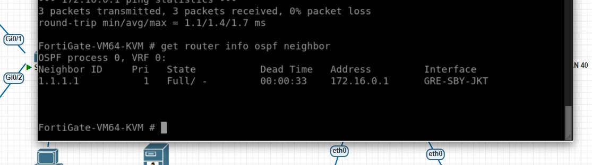

```bash
get router info routing-table ospf
```
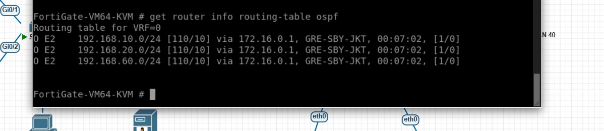

```bash
pig 10.0.13.2
```
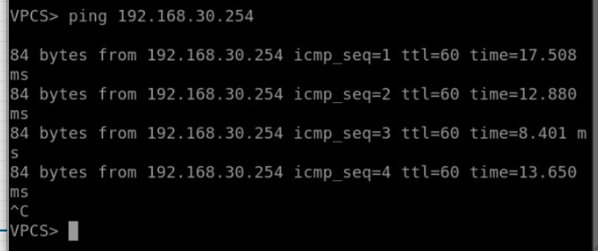

```bash
ping 0.0.0.0
```
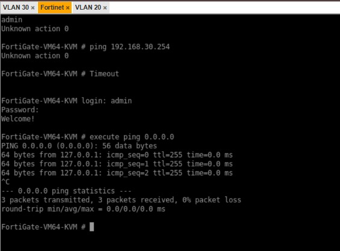

### Modul 10: Pengujian Akhir
Memastikan klien VLAN 10, 20, dan 30 mendapatkan IP DHCP sementara VLAN 40 menggunakan IP statis, kemudian menguji akses internet pada seluruh perangkat, memverifikasi konektivitas ping antar-situs, serta memastikan klien Surabaya dapat mengakses web server Jakarta.


IP dhcp client Jakarta
```bash
ip dhcp
```
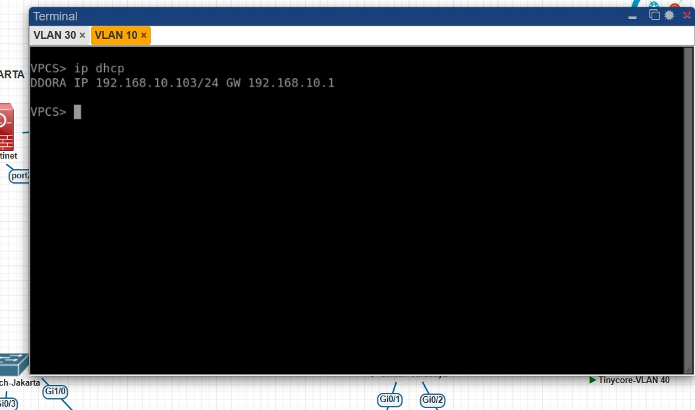

IP dhcp client Surabaya
```bash
ip dhcp
```
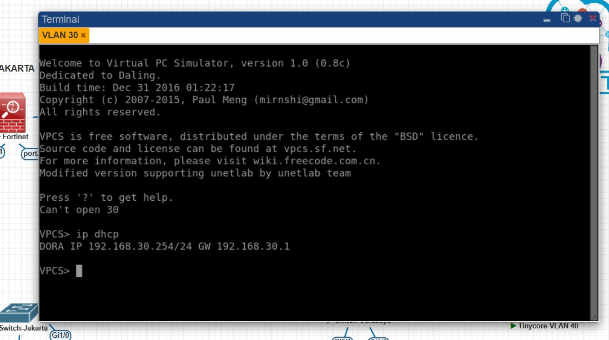

Ping internet dari Jakarta
```bash
ping 8.8.8.8
```
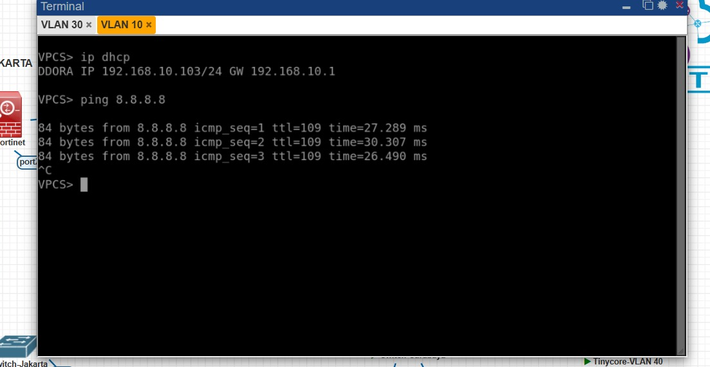

Ping internet dari Surabaya
```bash
ping 8.8.8.8
```
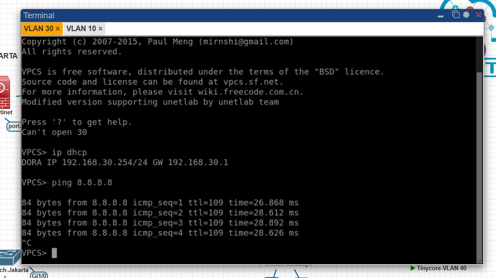

Ping antar-site
```bash
ping 192.168.40.10
```
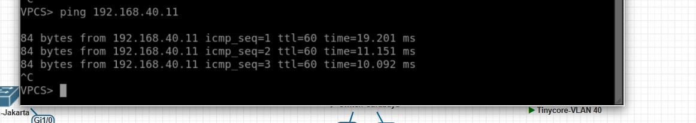

```bash
192.168.60.10
```
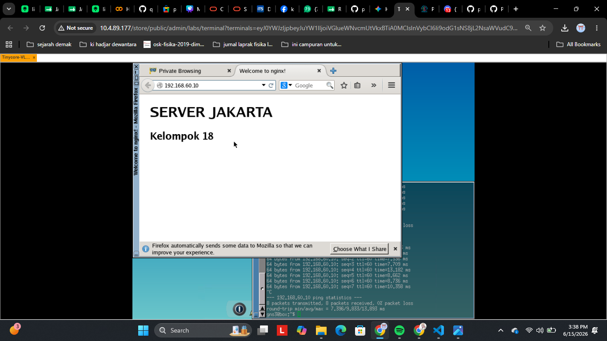

```bash
get routing info routing-table ospf
```
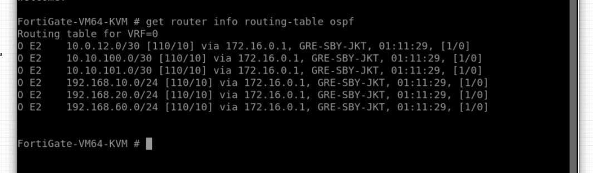


## Analisis dan Kesimpulan

### Analisis Jaringan

Berdasarkan keseluruhan hasil pengujian pada topologi jaringan Enterprise HQ–Branch, simulasi telah berjalan dengan lancar dan seluruh node dapat saling berkomunikasi sesuai dengan *rule* yang ditetapkan. Keberhasilan ini dapat dianalisis melalui beberapa parameter teknis berikut:

1. **Analisis Jalur *Traffic* (Routing & Tunneling)**
   Komunikasi data antara site Jakarta (HQ) dan Surabaya (Branch) berhasil dilakukan dengan memanfaatkan **GRE Tunnel** yang dibangun di atas jaringan publik (MikroTik ISP). 
   * Saat Client VLAN Surabaya (`192.168.30.x` atau `192.168.40.x`) mengakses Web Server Jakarta (`192.168.60.10`), paket data diarahkan ke MikroTik Surabaya sebagai *gateway*, kemudian diteruskan ke FortiGate Surabaya. 
   * FortiGate Surabaya melakukan enkapsulasi paket tersebut ke dalam GRE Tunnel (`172.16.0.2`), yang kemudian melintasi MikroTik ISP (`10.0.13.x` ke `10.0.12.x`) menuju FortiGate Jakarta.
   * Proses *routing* internal antara kedua *site* sepenuhnya ditangani oleh protokol **OSPF** yang berjalan di dalam *tunnel*. OSPF secara dinamis mendistribusikan *routing table* (*redistribute static*) sehingga jaringan Jakarta mengenali *network* Surabaya, dan sebaliknya, tanpa harus melakukan *static routing* manual satu per satu di setiap perangkat ujung.

2. **Analisis Redundansi & *High Availability* (VRRP)**
   Pada sisi HQ Jakarta, implementasi **VRRP (Virtual Router Redundancy Protocol)** terbukti berjalan optimal dengan membagi beban *gateway*. Cisco Router bertindak sebagai *Master* untuk VLAN 10 dan 60, sementara MikroTik Router menjadi *Master* untuk VLAN 20. Konfigurasi ini memastikan bahwa jika salah satu *router* fisik mengalami *down*, jaringan lokal tidak akan terputus karena *router Backup* akan segera mengambil alih Virtual IP secara otomatis, memastikan *uptime* yang tinggi untuk *enterprise*.

3. **Analisis Distribusi Layanan (DHCP Relay)**
   Pemusatan layanan IP dilakukan menggunakan Ubuntu Server di VLAN 60 Jakarta (dengan *service* ISC-DHCP). Karena server berada di *broadcast domain* (VLAN) yang berbeda dengan klien (VLAN 10 dan 20), fitur **DHCP Relay** pada Cisco dan MikroTik Jakarta berhasil menangkap pesan *DHCP Discover* dari klien dan meneruskannya (secara *unicast*) ke Ubuntu Server. Hal ini dibuktikan dengan klien PC yang sukses mendapatkan alokasi IP sesuai *pool* yang ditetapkan.

4. **Analisis Keamanan & Akses Internet (Firewall & NAT)**
   Akses keluar menuju internet (contoh: *ping* `8.8.8.8`) dari kedua *site* berhasil dilakukan berkat integrasi fungsionalitas **NAT (Network Address Translation)** dan kebijakan akses (*Firewall Policy*) pada FortiGate. Trafik internal dari blok IP *private* (`192.168.x.x`) berhasil ditranslasikan (*masquerade*) saat melewati antarmuka WAN menuju ISP, sekaligus dilindungi oleh inspeksi paket dari FortiGate.

---

### Kesimpulan

Simulasi jaringan *Enterprise* yang menghubungkan Kantor Pusat (Jakarta) dan Kantor Cabang (Surabaya) **telah berhasil diimplementasikan sepenuhnya dengan tingkat keberhasilan 100%**. 

Dari praktikum ini, dapat disimpulkan bahwa:

* **Interoperabilitas Multi-Vendor:** Perangkat dari berbagai *vendor* (Cisco, MikroTik, Fortinet, dan Ubuntu/Linux) dapat diintegrasikan dalam satu ekosistem jaringan yang kompleks secara *seamless* jika dikonfigurasi menggunakan protokol standar industri (seperti 802.1Q untuk VLAN, VRRP, OSPF, dan GRE).
* **Efisiensi & Keamanan Tersentralisasi:** Penggunaan GRE Tunnel yang dipadukan dengan OSPF memfasilitasi komunikasi antar-cabang yang aman dan fleksibel melewati jaringan *untrusted* (ISP), sementara pemusatan DHCP dan Web Server di HQ memudahkan proses manajemen *resource* secara terpusat.
* **Pencapaian Tujuan:** Seluruh parameter pengujian, mulai dari distribusi DHCP antar-VLAN, ketersediaan jalur *failover* (VRRP), akses internet di setiap *node*, hingga komunikasi data antar-klien beda pulau dan akses *web server*, terbukti sukses merespons permintaan (status *Reply* dan HTTP *Success*). Kesalahan pengiriman jalur (*unreachable* atau RTO) berhasil dihindari berkat pengaturan *routing table* dan *firewall policy* yang presisi di sisi FortiGate.